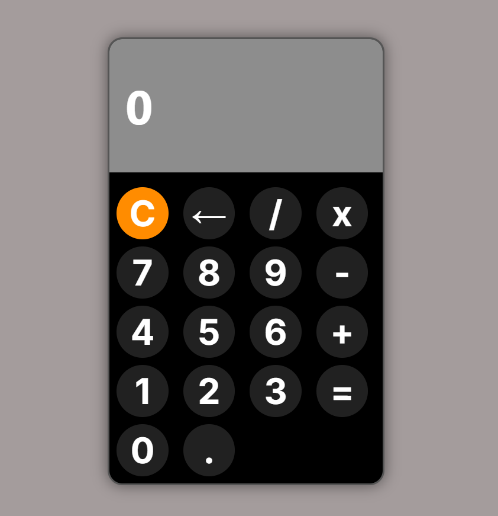

# Simple Calculator

A clean, functional calculator web app built with **vanilla HTML, CSS, and JavaScript** — no frameworks, no libraries, no build tools.

🔗 **Live Demo:** [adhamahmed007.github.io/Calculator](https://adhamahmed007.github.io/Calculator/)

---

## 🖼️ Preview



---

## 📌 Overview

This is a browser-based calculator that supports standard arithmetic operations through a clickable interface. It's a foundational project focused on core JavaScript concepts: DOM manipulation, event handling, and managing operation state without any external dependencies.

---

## ✨ Features

- **Basic arithmetic operations** — addition, subtraction, multiplication, and division.
- **Live display updates** — the screen updates instantly as numbers and operators are entered.
- **Clear/reset functionality** — reset the calculator to a fresh state at any point.
- **Click-based input** — a fully interactive on-screen button layout, no keyboard required.
- **Lightweight and dependency-free** — pure HTML, CSS, and JavaScript with no build step, so it loads instantly and runs anywhere.

---

## 🛠️ Tech Stack

| Technology | Purpose |
|---|---|
| **HTML5** | Structure and layout of the calculator interface |
| **CSS3** | Styling, button layout, and visual design |
| **JavaScript (ES6+)** | Input handling, calculation logic, and display updates |
| **GitHub Pages** | Hosting the live deployed site |

---

## ⚙️ How It Works

1. The user clicks number and operator buttons to build an expression.
2. Each click updates the calculator's display in real time.
3. Pressing the equals button evaluates the current expression and shows the result.
4. Pressing clear resets the display and internal state, ready for a new calculation.

---

## 🚀 Getting Started (Run Locally)

1. Clone the repository:
   ```bash
   git clone https://github.com/adhamahmed007/Calculator.git
   ```
2. Navigate into the project folder:
   ```bash
   cd Calculator
   ```
3. Open `index.html` directly in your browser — no installation or setup required.

---

## 👤 Author

**Adham Ahmed**
GitHub: [@adhamahmed007](https://github.com/adhamahmed007)

---

## 📄 License

This project is open for educational and personal use.
